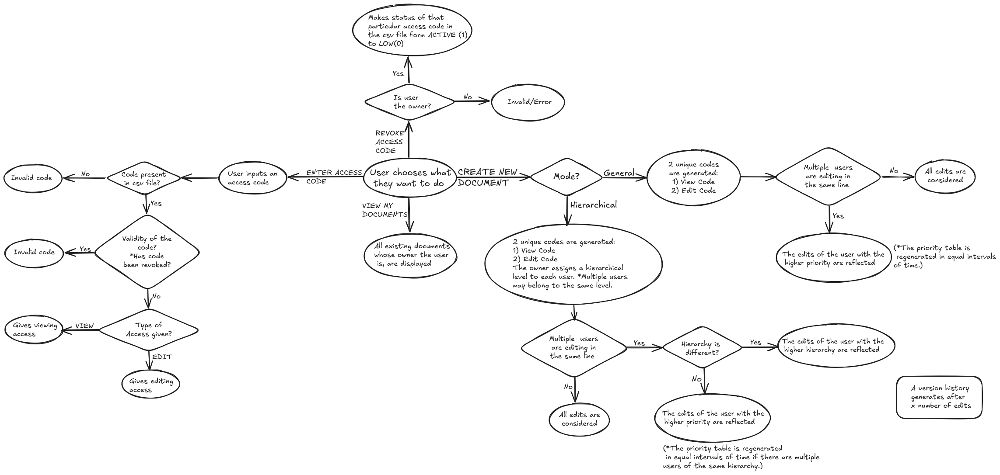

Module status: complete
Integration status: incomplete

Steps Left For Integration:
1. Fix redirect from sign in page to home: enable the redirecttoHome() function in editor.html
2. Fix redirect from home to editing window: enable the redirecttoEdit() option in editor.html
3. Enable hierarchy doc formation : enable firebase user system integraton in editor.html
4. Initiate automatic web socket connection upon use : initiate websocket formatin from backend.c through prompt in editor.html

USAGE RULES:
1. Sign IN/SIgn Out Page: authenticates users, allows joining multi-user document,etc
2. Home Page: login redirects to home page, which houses main menu for file opening, editing, etc
3. Editing WIndow: the editing window allows the docuemtn to be edited

Website link: https://text-editor-44f76.web.app/

Our features include:
1) Creat new document
2) View previous documents
3) Enter access code (to edit/view a document)
4) Revoke access code (can be done by the owner of the document only)

   
The features of our text editor are:
1)New file, Account, Save, Print
2)Header,Footer, B,I,U,St, Undo, Redo,Font Type & Size
3)Text Colour, Highlight Colour, Page Colour
4)Alignment, Line Spacing, Paragraph Format, Lists, Check list.
5)Digital Sign
6)Insert Image, Video, Audio, Links, Table, Chart, shapes, symbols
7)Origin, Margin, zoom in
8)Word Count

The flowchart below explains the working.

